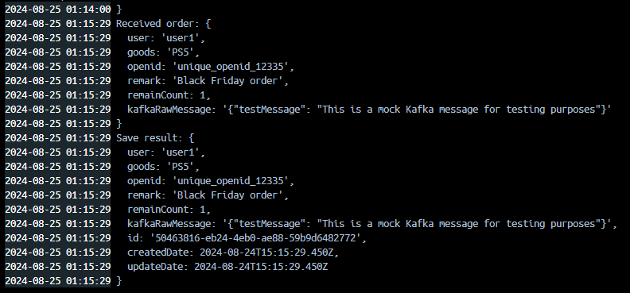
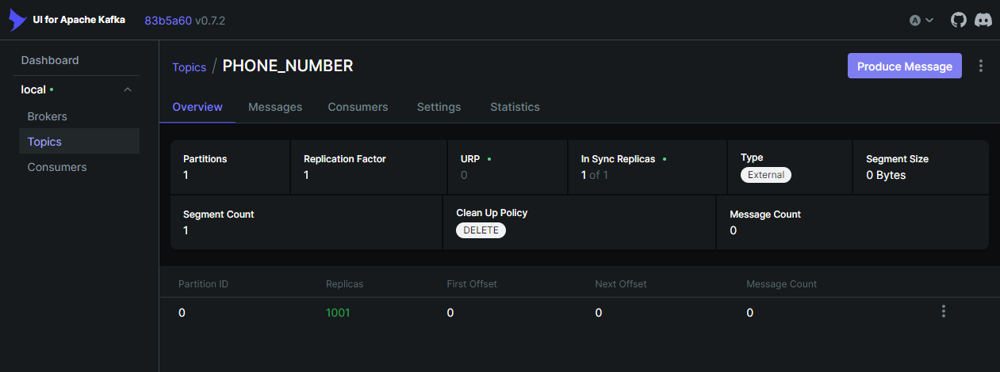

# NexusSale: High-Performance Flash Sale System

 

## Introduction

NexusSale is a state-of-the-art flash sale (also known as "seckill" or "lightning deal") system designed to handle extreme concurrency during
time-limited, high-demand sales events. This project demonstrates the implementation of a robust, scalable, and high-performance e-commerce backend
capable of managing inventory in real-time, processing orders rapidly, and maintaining system integrity under heavy load.

### Key Technical Solutions

1. **Redis for Inventory Management and Concurrency Control**:

   - Utilizes Redis as a high-speed, in-memory data store for real-time inventory counting.
   - Implements optimistic locking with Redis to handle concurrent inventory updates, preventing overselling while maintaining high throughput.
   - Acts as a buffer between the high-concurrency front-end requests and the backend database, significantly reducing database load.

2. **Kafka for Asynchronous Order Processing**:
   - Employs Kafka as a distributed message queue to decouple order creation from order processing.
   - Producers quickly write order requests to Kafka topics, allowing the system to respond swiftly to user requests even under high load.
   - Consumers process orders asynchronously, ensuring steady order fulfillment without overwhelming the system.

### Business Scenario and Benefits

In a flash sale scenario, thousands of customers might attempt to purchase a limited-stock item simultaneously. This system addresses several critical
challenges:

1. **Inventory Accuracy**: Redis-based inventory management with optimistic locking ensures that each item is sold only once, preventing overselling
   and customer disappointment.
2. **System Responsiveness**: By quickly acknowledging orders through Kafka, the system remains responsive even when processing backend operations.
3. **Scalability**: The distributed nature of Kafka allows for easy scaling of order processing by adding more consumers as needed.
4. **Data Consistency**: While providing high-speed responses, the system ensures that all order data is eventually consistent and accurately recorded
   in the MySQL database.
5. **Peak Load Handling**: The combination of Redis caching and Kafka queuing allows the system to smooth out traffic spikes, preventing system
   overload during peak times.

This architecture enables businesses to confidently run flash sales campaigns, maximizing sales opportunities while providing a smooth customer
experience, even under extreme traffic conditions.

## Technology Stack

NexusSale leverages a carefully selected stack of cutting-edge technologies:

1. **NestJS**: A progressive Node.js framework for building efficient, reliable, and scalable server-side applications. Chosen for its modular
   architecture, dependency injection, and TypeScript support, enabling clean, maintainable code.

2. **Kafka**: A distributed event streaming platform used for high-throughput, fault-tolerant handling of real-time data feeds. Crucial for decoupling
   order processing from the main application flow, ensuring system responsiveness during peak loads.

3. **ZooKeeper**: A centralized service for maintaining configuration information, naming, providing distributed synchronization, and providing group
   services. It's an essential component for managing a Kafka cluster, handling broker coordination, and storing critical metadata.

4. **Redis**: An in-memory data structure store used as a cache and message broker. Essential for maintaining real-time inventory counts and reducing
   database load.

5. **MySQL**: A robust relational database management system for persistent storage of order and inventory data. Selected for its reliability,
   performance, and ACID compliance.

6. **Docker & Docker Compose**: Containerization tools that ensure consistency across development, testing, and production environments, simplifying
   deployment and scaling.

7. **Swagger**: An interface description language for describing RESTful APIs. Integrated to provide interactive API documentation.

8. **Kafka UI**: A web UI for Apache Kafka, facilitating easier monitoring and management of Kafka clusters.

## Key Features

- High-concurrency support with ability to handle thousands of requests per second
- Real-time inventory management to prevent overselling
- Distributed system architecture for high availability and scalability
- Asynchronous order processing using Kafka for improved system responsiveness
- Data persistence with MySQL for reliable order and inventory tracking
- API-first design with Swagger documentation for easy integration and testing
- Comprehensive monitoring and management tools for system health and performance

## Prerequisites

- Docker and Docker Compose
- Node.js (v14+)
- npm or yarn
- Postman (for API testing)

您说得对，使用 Docker Compose 确实可以简化安装过程。我们来修改一下 Installation 部分，使其更加简洁和直接。以下是更新后的 Installation 部分：

## Installation

1. Clone the repository:

   ```
   git clone https://github.com/yourusername/NexusSale.git
   cd NexusSale
   ```

2. Build and start the services:

   ```
   docker-compose build --no-cache
   docker-compose up -d
   ```

   This command will build the Docker images without using the cache, and then start all the services defined in your docker-compose.yml file in
   detached mode.

3. Check the status of the services:

   ```
   docker-compose ps
   ```

   Ensure all services are up and running.

The system should now be operational. You can access:

- NestJS Application: http://localhost:3000
- Swagger UI: http://localhost:3000/api-docs
- Kafka UI: http://localhost:8080

## Usage

After starting the services, the following components will be available:

- NestJS Application: http://localhost:3000
- Swagger UI: http://localhost:3000/api-docs
- Kafka UI: http://localhost:8080

## Testing

1. Use Postman to test the API endpoints:

- Import the provided Postman collection (if available)
- Or create new requests as per the API Endpoints section

2. Example flash sale order creation:

```
POST http://localhost:3000/seckill/add
Content-Type: application/json
{
"user": "testUser",
"goods": "testProduct",
"remark": "Test flash sale order"
}
```

3. Monitor the application logs for Kafka producer and consumer activities.

4. Check the Kafka UI to observe message queue status.

5. Verify data persistence by querying the orders:

```
GET http://localhost:3000/order/all
```

## Monitoring

- Use Kafka UI (http://localhost:8080) to monitor Kafka topics, consumers, and message flow.
- Check application logs for detailed system behavior and error tracking.
- Monitor Redis cache using Redis CLI or a Redis management tool.

## Contributing

Contributions are welcome! Please feel free to submit a Pull Request.

## Todo

- [ ] Implement comprehensive unit and integration tests
- [ ] Set up CI/CD pipeline for automated testing and deployment
- [ ] Enhance error handling and logging mechanisms
- [ ] Implement rate limiting to prevent abuse
- [ ] Add user authentication and authorization
- [ ] Optimize database queries and indexing
- [ ] Implement a caching strategy for frequently accessed data
- [ ] Set up monitoring and alerting system (e.g., Prometheus and Grafana)
- [ ] Conduct performance testing using Apache JMeter for high-concurrency scenarios
- [ ] Implement data analytics and reporting features
- [ ] Explore and implement database sharding for improved scalability
- [ ] Develop an admin dashboard for system management and monitoring
- [ ] Implement a fallback mechanism for service unavailability
- [ ] Optimize Kafka consumer group configurations for better performance
- [ ] Implement distributed tracing (e.g., using Jaeger or Zipkin)
